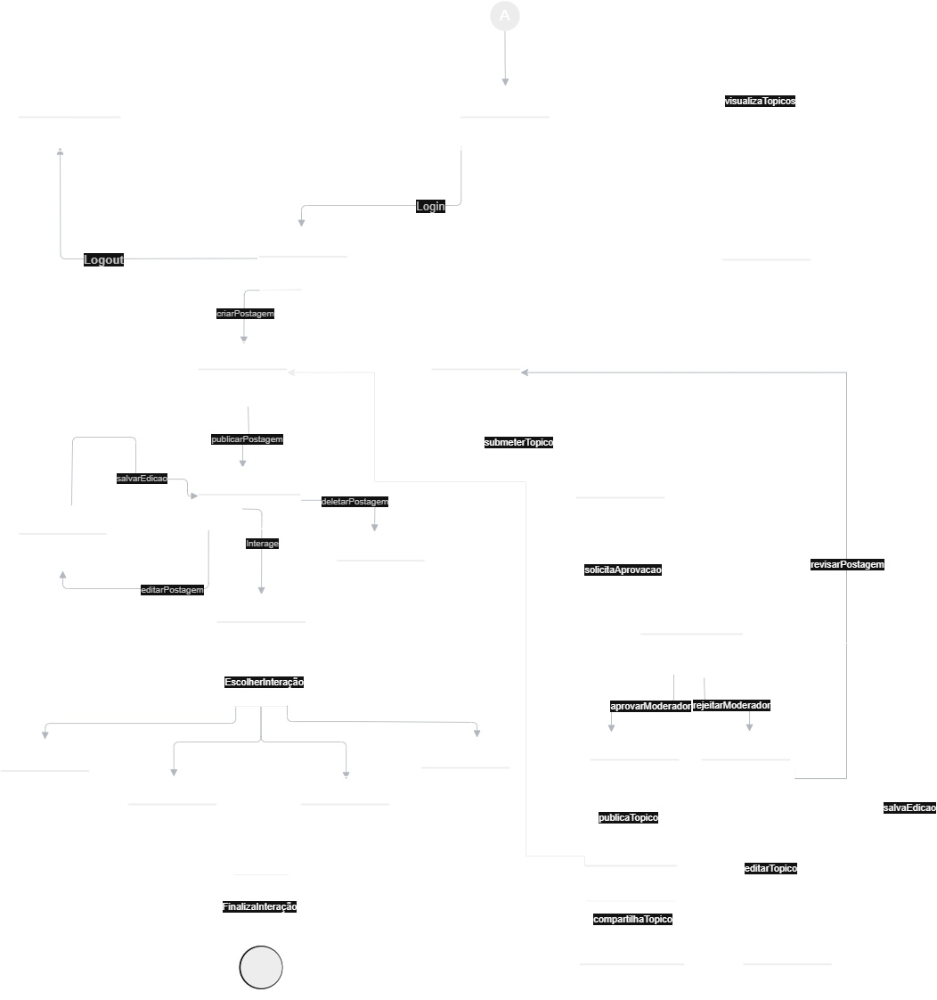

## Diagrama de Estados

### Introdução

O diagrama de estados tem como objetivo ilustrar os diferentes estados pelos quais um objeto do sistema **Café e Cia** pode passar ao longo de seu ciclo de vida, assim como os eventos que causam essas transições. Esse diagrama oferece uma visão comportamental do sistema, permitindo entender como os objetos reagem a estímulos internos ou externos de forma dinâmica.

Além disso, por ser construído em UML, o diagrama de estados do **Café e Cia** é independente da linguagem de implementação e auxilia na especificação, validação e documentação do comportamento esperado dos objetos, contribuindo para a clareza na modelagem e na manutenção do sistema.

Um estado representa uma condição momentânea de um objeto, enquanto as transições mostram como ele muda de estado em resposta a eventos. No contexto do **Café e Cia**, o diagrama de estados descreve, por exemplo, o fluxo de uma postagem — desde sua criação, edição, denúncia até a exclusão — ou ainda o comportamento de usuários ao navegar e interagir com o sistema.

### Metodologia

Para elaborar o Diagrama de Estados, foram feitas as seguintes etapas:

1. **Análise dos requisitos:** foi feita uma análise detalhada das funcionalidades previstas no escopo do projeto para identificar os principais módulos do sistema.  
2. **Referência ao diagrama de classes:** utilizou-se o diagrama de classes como base para entender as responsabilidades atribuídas a cada pacote e componente.  
3. **Construção colaborativa:** o diagrama foi desenvolvido de forma conjunta por meio da ferramenta Draw.io, permitindo edições simultâneas.

### Diagrama

<b>Figura 1.</b>  Diagrama de Estados do Café e Cia 

<b>Autores:</b>  [Genilson Junior](https://github.com/GenilsonJrs) e [Pedro Henrique](https://github.com/PedroHhenriq)  2025

### Conclusão

Com a construção do diagrama de estados, a equipe do **Café e Cia** conseguiu representar de forma clara e organizada os diferentes estados pelos quais os principais elementos do sistema podem transitar, assim como os eventos que provocam essas mudanças. Esse tipo de diagrama foi essencial para aprofundar o entendimento sobre o comportamento dinâmico da aplicação, especialmente no que diz respeito às interações dos usuários com funcionalidades como postagens, eventos e sistema de autenticação.

Durante a elaboração, houve discussões sobre quais entidades realmente necessitavam de um acompanhamento de estados, como o caso das postagens, que podem ser ativas, denunciadas ou removidas, e quais seriam melhor representadas por outros diagramas, como os de atividades ou de sequência. A equipe buscou referências em materiais acadêmicos e exemplos práticos para garantir que o diagrama refletisse de forma fiel os fluxos reais de uso.

### Gravação da Reunião

<b>Vídeo 1.</b>  Diagrama de Estados do Café e Cia 

<iframe width="560" height="315" src="https://www.youtube.com/embed/BT12O77mpMo?si=hBsHUWShOCQ6koNe" title="YouTube video player" frameborder="0" allow="accelerometer; autoplay; clipboard-write; encrypted-media; gyroscope; picture-in-picture; web-share" referrerpolicy="strict-origin-when-cross-origin" allowfullscreen></iframe>

<b>Autores:</b>  [Genilson Junior](https://github.com/GenilsonJrs) e [Pedro Henrique](https://github.com/PedroHhenriq)  2025

### Bibliografia

- **draw.io.** Como criar diagramas UML online gratuitamente. Disponível em: [https://www.drawio.com/](https://www.drawio.com/). Acesso em: 09 de maio de 2025.
- **Lucidchart.** Diagrama de componentes UML: o que é, como fazer e exemplos. Disponível em: [https://www.lucidchart.com/pages/pt/diagrama-de-componentes-uml](https://www.lucidchart.com/pages/pt/diagrama-de-componentes-uml). Acesso em: 08 de maio de 2025.  
- **Creately.** Tutorial de diagrama de componentes. Disponível em: [https://creately.com/blog/pt/diagrama/tutorial-de-diagrama-de-componentes-2/](https://creately.com/blog/pt/diagrama/tutorial-de-diagrama-de-componentes-2/). Acesso em: 08 de maio de 2025.

### Histórico de Versão

| Versão | Data | Descrição | Autor(es) | Revisor(es) |
| :-: | :-: | :-: | :-: | :-: |
| `1.0` | 09/05/2025  | Criação do documento e conteúdo. | [Genilson Junior](https://github.com/GenilsonJrs) | [Gustavo Alves](https://github.com/gustaallves)|
