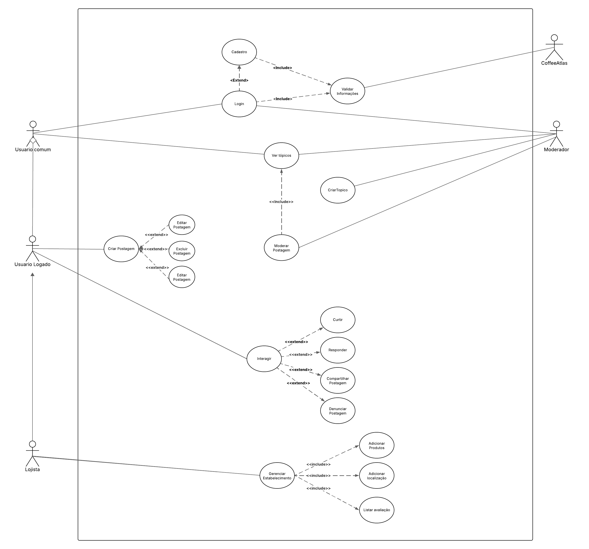

# Diagrama de Caso de Uso - Organizacional

## Introdução

O Diagrama de Caso de Uso é uma ferramenta fundamental da UML para modelar o comportamento funcional de um sistema. Sendo assim, ele ilustra as interações entre os **atores** (usuários ou outros sistemas) e os **casos de uso** (funcionalidades do sistema).

Sendo essencial nas fases iniciais de análise de requisitos, o diagrama de caso de uso ajuda a definir o escopo do sistema, identificar os principais fluxos de interação e comunicar as funcionalidades esperadas para os usuários. A partir disso, os relacionamentos mais comuns em um diagrama de caso de uso incluem:
- **Associação:** Liga um ator a um caso de uso, indicando participação deste.
- **Include:** Indica que um caso de uso incorpora o comportamento de outro caso de uso para completar sua funcionalidade. Desta forma, o caso de uso incluído é essencial e não pode ocorrer sozinho.
- **Extend:** Indica que um caso de uso pode estender o comportamento de outro caso de uso em um ponto específico. Assim, o caso de uso estendido é opcional e ocorre sob certas condições.
- **Generalização:** Representa a herança entre atores.

## Objetivo

Este documento tem como objetivo descrever o comportamento funcional de um sistema de fórum online dedicado a entusiastas de café através de um Diagrama de Caso de Uso.

Através deste diagrama, busca-se:
- Identificar os atores que interagem com o sistema.
- Definir os principais casos de uso que representam as funcionalidades do sistema.
- Ilustrar as relações entre os atores e os casos de uso.
- Detalhar as relações de inclusão (`<<include>>`) e extensão (`<<extend>>`) entre os casos de uso.
- Servir como base para um possível desenvolvimento e documentação do sistema.
- Facilitar a comunicação entre a equipe.

O diagrama também visa contemplar as diversas funcionalidades observadas no diagrama fornecido, como autenticação, interação e moderação.

## Metodologia

A criação deste Diagrama de Caso de Uso foi baseada na análise do diagrama fornecido e nos princípios da UML para modelagem de comportamento. Partindo disso, foram identificados os atores principais e os casos de uso que representam as funcionalidades do sistema a partir da perspectiva desses atores. Deste modo, as relações entre eles foram definidas para ilustrar como os atores utilizam o sistema para alcançar seus objetivos. As relações `<<include>>` e `<<extend>>` foram utilizadas para decompor funcionalidades complexas e representar comportamentos opcionais.

## Diagrama de Caso de Uso Criado

### Descrição

Modela as interações entre diferentes tipos de usuários (Usuário Comum, Usuário Logado, Lojista, Moderador, CoffeeAtlas) e as funcionalidades do sistema de fórum, incluindo autenticação, gerenciamento de postagens e tópicos, interação social, gerenciamento de estabelecimentos e produtos, e moderação.

### Diagrama de Caso de Uso

Autores: [Pedro Henrique](https://github.com/PedroHhenriq), [Samuel Ribeiro](https://github.com/SamuelRicosta) e [Nicollas Gabriel](https://github.com/Nicollaxs), 2025

### Atores e Casos de Uso

- **Usuário Comum:** Pode realizar o **Cadastro** e o **Login**, assim como **Ver Tópicos**.
- **Usuário Logado:** Herda as funcionalidades do Usuário Comum e pode **Ver Tópicos**, **Criar Postagem** (Que realiza `<<extend>>` com **Editar Postagem** e **Excluir Postagem**), e **Interagir** (que inclui **Curtir**, **Responder**, **Compartilhar Postagem**, e pode realizar `<<extend>>` com **Denunciar Postagem**).
- **Lojista:** Herda as funcionalidades do Usuário Logado e pode **Gerenciar Estabelecimento** (que inclui **Adicionar Produtos** e **Adicionar Avaliações**).
- **Moderador:** Pode **Ver Tópicos**, **Criar Tópico**, e **Moderar Postagem**.
- **CoffeeAtlas:** Pode **Validar Informações**.
- **Cadastro:** Permite o registro de novos usuários no sistema e realizar `<<include>>` com **Validar Informações**.
- **Login:** Permite que usuários previamente cadastrados acessem o sistema e realiza `<<include>>` com **Validar Informações**.
- **Ver Tópicos:** Permite aos usuários visualizar os tópicos existentes no fórum.
- **Criar Tópico:** Permite aos usuários criar novos tópicos de discussão.
- **Criar Postagem:** Permite aos usuários criar posts dentro de um tópico.
- **Editar Postagem:** Permite aos usuários modificar suas próprias postagens (extensão de Criar Postagem).
- **Excluir Postagem:** Permite aos usuários remover suas próprias postagens (extensão de Criar Postagem).
- **Interagir:** Caso de uso genérico que agrupa as formas de interação com as postagens.
- **Curtir:** Permite aos usuários curir uma postagem (extensão de Interagir).
- **Responder:** Permite aos usuários escrever uma resposta a uma postagem (extensão de Interagir).
- **Compartilhar Postagem:** Permite aos usuários compartilhar uma postagem (extensão de Interagir).
- **Denunciar Postagem:** Permite aos usuários reportar postagens inapropriadas (extensão de Interagir).
- **Moderar Postagem:** Permite aos moderadores gerenciar as postagens do fórum.
- **Gerenciar Estabelecimento:** Permite aos lojistas gerenciar informações sobre seus estabelecimentos.
- **Adicionar Produtos:** Permite aos lojistas adicionar produtos ao seu estabelecimento (inclusão de Gerenciar Estabelecimento).
- **Adicionar Avaliações:** Permite aos lojistas adicionar avaliações ao seu estabelecimento (inclusão de Gerenciar Estabelecimento).
- **Validar Informações:** Caso de uso que representa a validação de dados durante o cadastro e login (incluído por Cadastro e Login).

## Bibliografia

[1] OMG. *Unified Modeling Language (UML) Specification*. Disponível em: [https://www.omg.org/spec/UML](https://www.omg.org/spec/UML). 

[2] Lucidchart. *Diagrama de Caso de Uso UML*. Disponível em: [https://www.lucidchart.com/pages/pt/diagrama-de-caso-de-uso-uml](https://www.lucidchart.com/pages/pt/diagrama-de-caso-de-uso-uml). 

[3] Academia.edu. *Diagramas de Casos de Uso*. Disponível em: [https://www.academia.edu/8020199/Diagramas_de_Casos_de_Uso](https://www.academia.edu/8020199/Diagramas_de_Casos_de_Uso). 

[4] GUEDES, G. T. A. *UML: Uma abordagem prática*. Novatec Editora, 2018.

## Histórico de Versão

| Versão | Data       | Alteração              | Responsável     | Revisor           | Data de revisão |
|--------|------------|------------------------|------------------|-------------------|------------------|
| 1.0    | 09/05/2025 | Criação do documento   | [Pedro Henrique](https://github.com/PedroHhenriq)  | [Gustavo Alves](https://github.com/gustaallves)   |   09/05/2025     |

## Controle de Revisão

| Revisor(es)      | O que foi realizado                                      |
|------------------|----------------------------------------------------------|
|  [Gustavo Alves](https://github.com/gustaallves) |    Checagem do documento          |