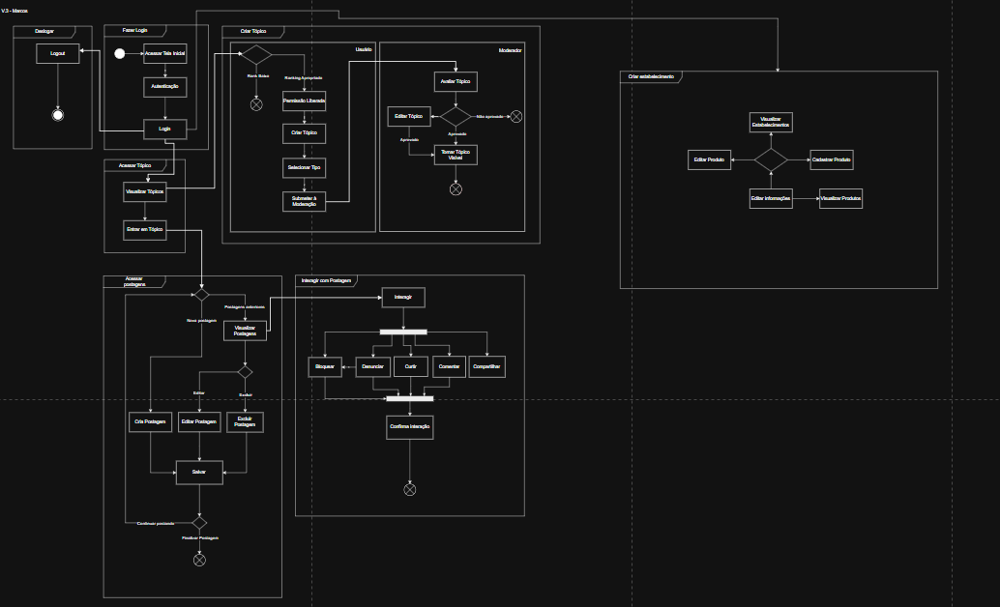

# ☕ Coffee Atlas

**Código da Disciplina**: FGA0208 
**Número do Grupo**: 06 
**Entrega**: 02 

## Alunos

|Matrícula | Aluno |
| -- | -- |
| 22/1007690  |  [Diego Carlito Rodrigues de Souza](https://github.com/DiegoCarlito) |
| 21/1030747  |  [Filipe Carvalho da Silva](https://github.com/Filipe-002) |
| 20/2045482  |  [Genilson Silva de Araújo Júnior](https://github.com/GenilsonJrs) |
| 21/1031708  |  [Geovane Alessandro dos Santos Freitas](https://github.com/GeovaneSFT) |
| 20/2016364  |  [Guilherme Coelho Mendonça](https://github.com/Guilermanoo) |
| 21/1063111  |  [Gustavo Alves de Souza](https://github.com/gustaallves) |
| 22/1022014  |  [João Vitor Lopes Ribeiro](https://github.com/Joa0V) |
| 22/1008300  |  [Marcos Antonio Teles de Castilhos](https://github.com/Marcosatc147) |
| 21/1062802  |  [Nicollas Gabriel Oliveira Sousa](https://github.com/Nicollaxs) |
| 21/1031486  |  [Samuel Ribeiro Da Costa](https://github.com/Samuelricosta) |
| 20/0026151  |  [Pedro Henrique F. Nunes](https://github.com/PedroHhenriq) |

## Sobre 

Nesta segunda etapa do projeto Café e Cia, o grupo avançou para a modelagem da estrutura interna do sistema, representando os principais elementos e comportamentos da solução proposta. Com base nas definições realizadas na entrega anterior, buscamos traduzir os requisitos em representações visuais que descrevem como o sistema será organizado e como seus componentes irão interagir.

A partir da análise dos perfis de usuários e funcionalidades esperadas, foram produzidos diagramas UML que ajudam a visualizar a arquitetura lógica do sistema. A criação desses artefatos teve como objetivo não apenas documentar, mas também validar o entendimento coletivo do grupo sobre a solução, garantindo alinhamento técnico e clareza na comunicação entre os membros da equipe.

Essa etapa foi essencial para estruturar a base do desenvolvimento, permitindo que a complexidade do sistema fosse dividida em partes compreensíveis e coerentes com os objetivos definidos na fase inicial do projeto.

## Screenshots da Segunda Entrega

Abaixo, as figuras de partes do projeto geral.

  
<b>Figura 1 – Diagrama de Classe</b>

    

<b>Figura 2 – Fluxo</b>

  

    

<b>Autor:</b>  [Toda a equipe](), 2025

<b>Figura 3 – Versão 2 do Diagrama de Casos de Uso</b>

  

    

<b>Autor:</b>  [Toda a equipe](), 2025

## Há algo a ser executado?

( ) SIM

(✓) NÃO

## Informações Complementares

No desenvolvimento dos artefatos, também foi importante observar a valorização de experiências colaborativas. O interesse e colaboração influenciaram diretamente a construção do escopo e de todo o projeto, reforçando a intenção e importancia de criar um ambiente de trabalho de parceria, promovendo troca de experiências e conexão entre pessoas com o mesmo interesse.

## Quadro Colaborativo (Miro)

  
<b>Quadro Colaborativo Miro</b>

<iframe width="768" height="432" src="https://miro.com/app/live-embed/uXjVI-wy_ZU=/?moveToViewport=6778,8349,13026,10430&embedId=63990605328" frameborder="0" scrolling="no" allow="fullscreen; clipboard-read; clipboard-write" allowfullscreen></iframe>

<b>Autor:</b>  [Toda a equipe](), 2025

## Histórico de Versão

| Versão | Data       | Alteração              | Responsável     | Revisores          | Data de revisão |
|--------|------------|------------------------|------------------|-------------------|------------------|
| 1.0    | 08/05/2025 | Versão inicial do artefato  |[Gustavo Alves](https://github.com/gustaallves) |  [Filipe Carvalho](https://github.com/filipe-002)  |    09/05/2025    |
| 1.0    | 09/05/2025 | Corrigindo imagens  | [Filipe Carvalho](https://github.com/filipe-002) | [Diego Carlito](https://github.com/DiegoCarlito) |    09/05/2025    |

## Controle de Revisão

| Revisor(es)      | O que foi realizado                                      |
|------------------|----------------------------------------------------------|
|  [Diego Carlito](https://github.com/DiegoCarlito) |    Ajuste caminho de imagem         |
